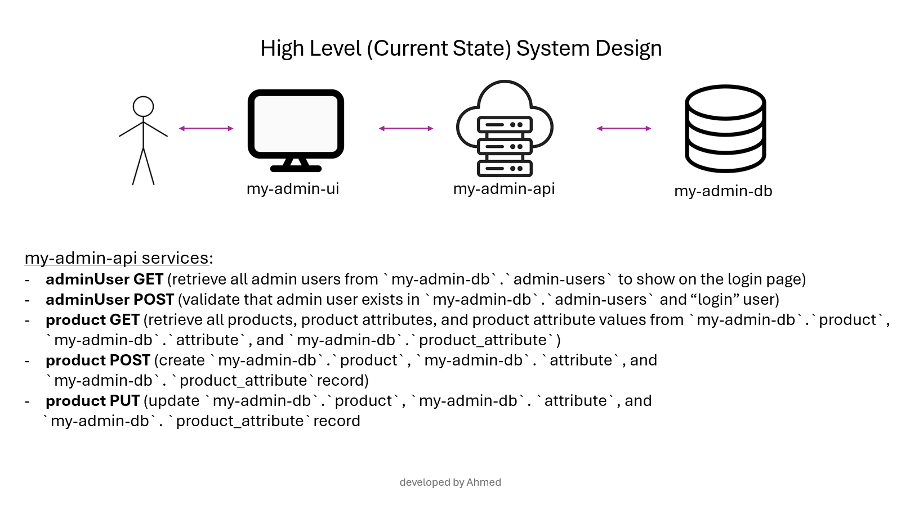
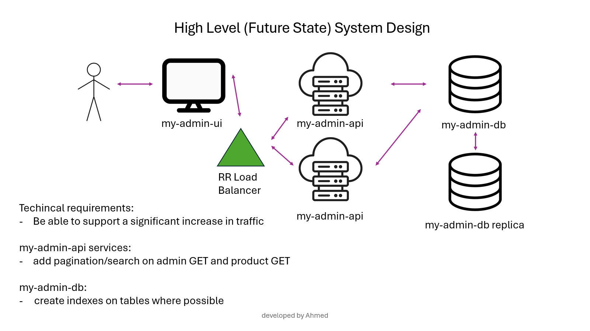
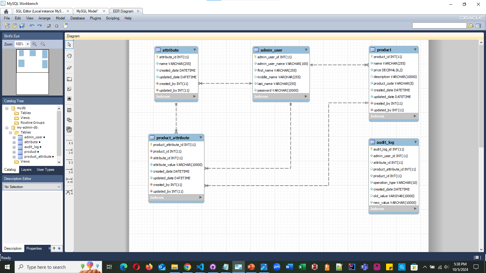
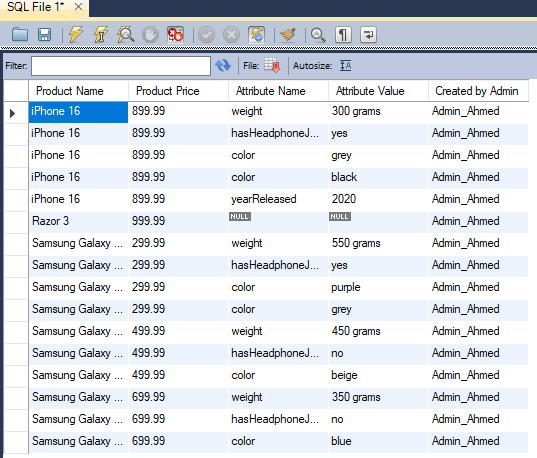
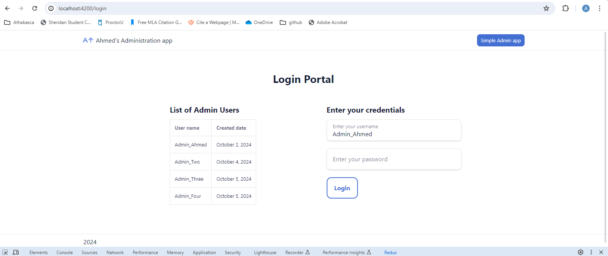
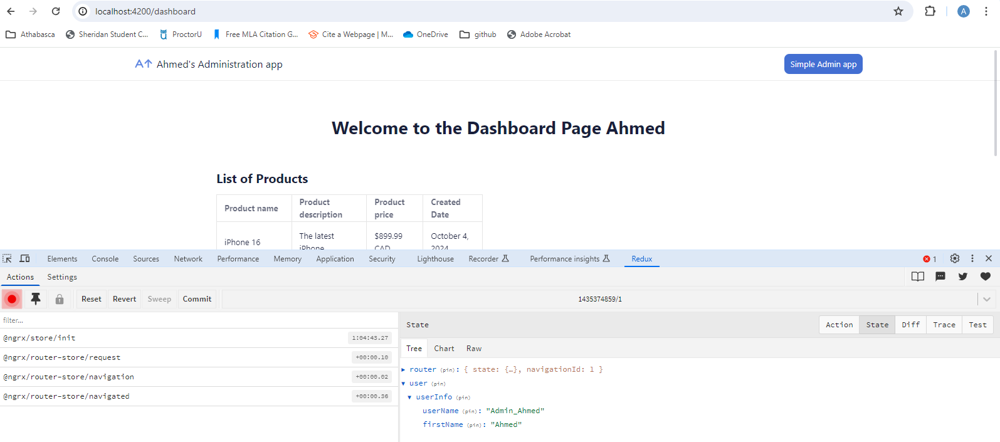
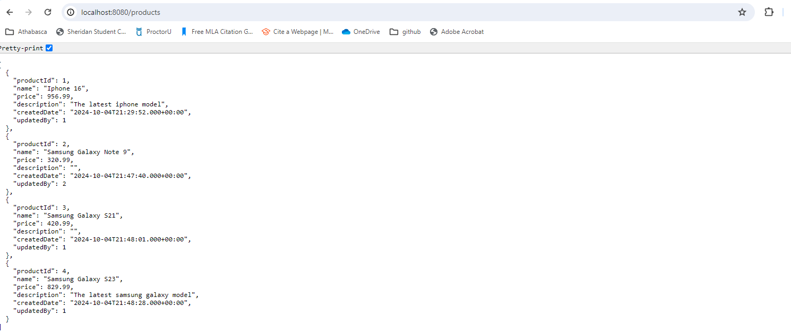
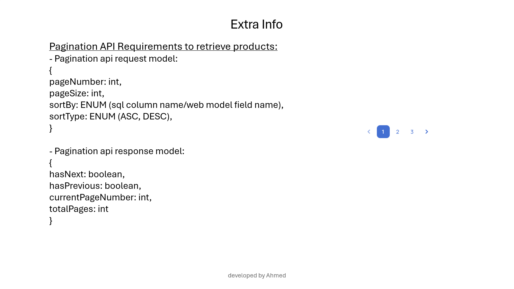

#  &nbsp; Ahmed's Administration App

## Requirements

- Administrator users can login to the "my-admin-ui" portal
- After they login, they will be presented with a dashboard. This should not be able to be accessed to unauthenticated users.
- On the dashboard, the administrator user will see a list of all the products with their corresponding product attributes (such as name, description, price, and several dynamic attributes that may be different for each product).
- The administrator user should be able to add, update, or delete products.
- Every product transaction should be recorded for audit log purposes

## Techincal Requirements

- Should be able to support 1 TPS
- Administrator users can be from North America only

#



#



#

### my-admin-db schema with audit_log table



#

### sample result set from SQL query

```SQL
USE `my-admin-db`;

select product.name as 'Product Name',
product.price as 'Product Price',
attribute.name as 'Attribute Name',
product_attribute.attribute_value as 'Attribute Value',
admin_user.admin_user_name as 'Created by Admin'
from product
left join product_attribute
on product.product_id = product_attribute.product_id
left join attribute
on attribute.attribute_id = product_attribute.attribute_id
cross join admin_user
on product.created_by = admin_user.admin_user_id
order by product.name;
```



#

### my-admin-ui Login Portal for unauthenticated admin users



#

### my-admin-ui Dashboard Portal for authenticated users

##### NOTE: the user info has been saved into the NGRX state



#

### my-admin-api GET product (prior to changing schema)



#

### Links

- [All Sql Scripts](./my-admin-db/updated-sql-scripts.txt)
- [All Assets](./assets/)

#

### TODO

#### UI

- add guard for dashboard component so that unauthenticated users are re-directed to login page by default
- add loader on every component
- implement NGRX effect pattern on api calls
- unit and e2e tests
- add comments where necessary
- finish full implementation

#### API

- implement hashing algorithm/API so that passwords could be encrypted when saving into DB
- implemnt Pagination so that as the products table grows, you can get the page you want
- implement a search for products
- unit and integration tests
- add comments where necessary
- finish full implementation

#### Overall Requirements

- Develop further requirements and add more features that may be helpful for users of the application

#

### Extra Information

A sample pagination model may look like:



#

##### <b><i>An App Developed by Ahmed</i></b>
